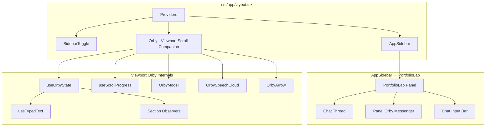
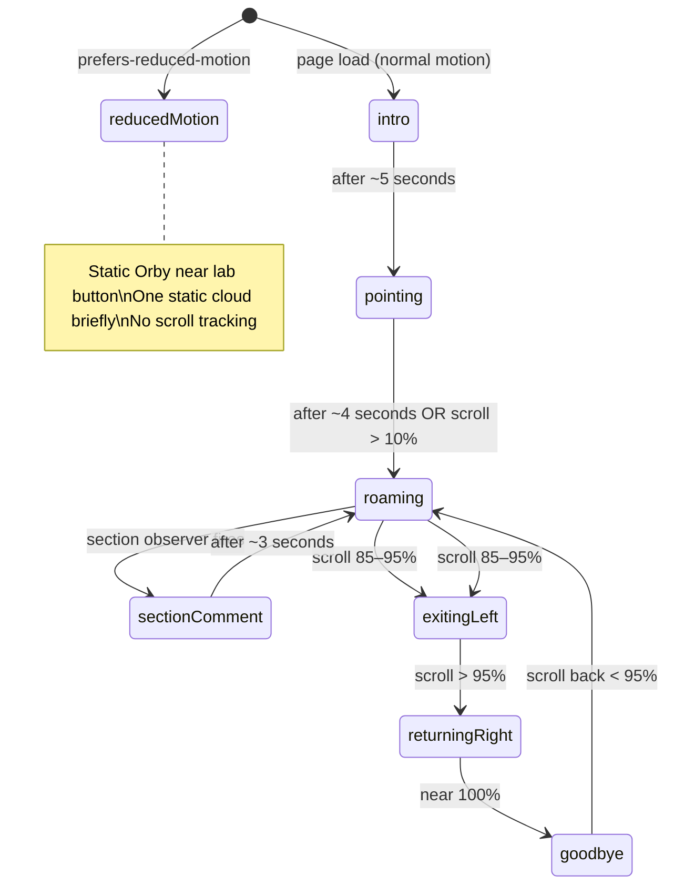
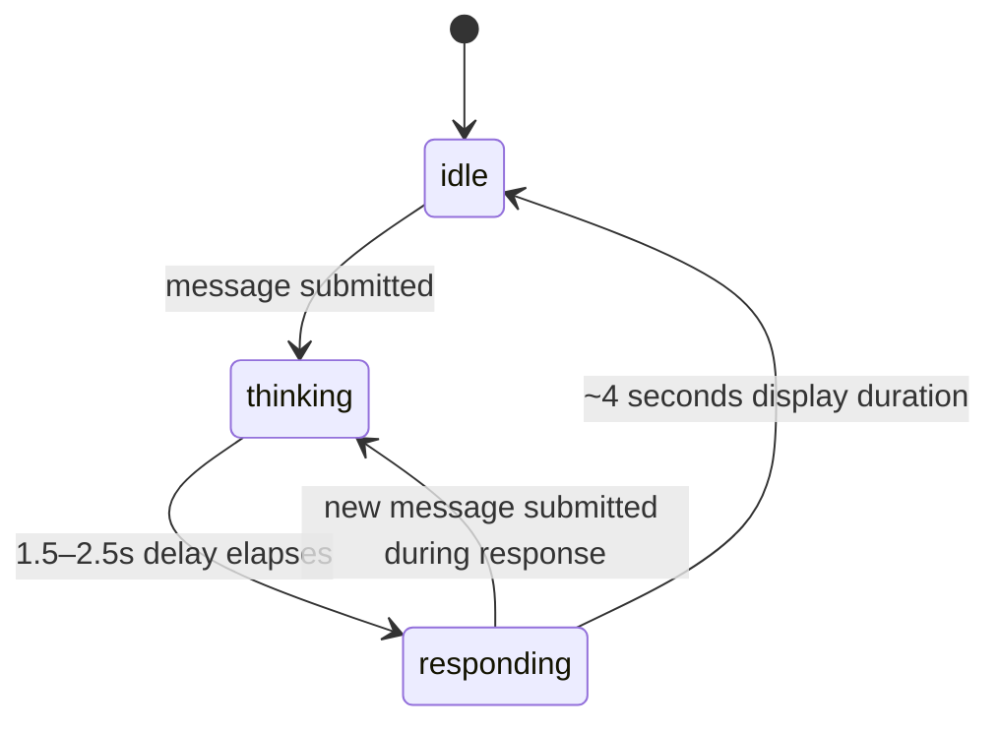

# Design Document: Portfolio Lab Orby Redesign

## Overview

This design replaces the Portfolio Lab's static Q&A interface (mode selectors, chips, pre-written responses) with a chat-first experience powered by Orby — a tiny CSS astronaut companion. The redesign has two distinct surfaces:

1. **Viewport Orby (Scroll Companion):** A purely decorative, scroll-linked astronaut character that floats in the main viewport near the bottom-right, introduces visitors to the Portfolio Lab, roams across the screen during scroll, and delivers one-shot section comments.

2. **Panel Orby (Messenger):** Inside the Portfolio Lab sidebar, Orby serves as the conversational reply surface. A chat input bar and thread live in the panel; when users submit messages, Panel Orby reacts with a thinking animation and always returns the same "coming soon" response via speech cloud.

No AI backend, no API routes, no LLM calls. The entire feature is client-side React state + CSS + Framer Motion.

### Key Decisions

- **Pure CSS character** — No Three.js, no GLB models, no SVG files. Orby is built from layered divs, CSS gradients, box-shadow, and border-radius.
- **Framer Motion for orchestration** — AnimatePresence for speech cloud enter/exit, motion for layout transitions. Import from `"motion/react"`.
- **State machine pattern** — A finite state machine manages all Orby behavior, derived from scroll progress, timers, sidebar state, section observers, and user messages.
- **Two Orby instances** — Viewport Orby (scroll companion) and Panel Orby (messenger) are separate render trees with shared visual components (OrbyModel, OrbySpeechCloud).

---

## Architecture



### Render Order in layout.tsx

```tsx
<Providers>
  <div className="flex min-h-svh w-full overflow-x-hidden">
    <main className="relative min-w-0 flex-1">{children}</main>
    <AppSidebar side="right" />
  </div>
  <SidebarToggle />
  <Orby />          {/* ← NEW: Viewport scroll companion */}
</Providers>
```

Orby renders **after** SidebarToggle, inside the Providers tree. It is a `"use client"` component loaded via `next/dynamic` with `{ ssr: false }`. It must NOT be server-rendered.

---

## Components and Interfaces

### Component Tree

```
src/components/orby/
├── Orby.tsx                 # Root viewport companion — state machine, positioning
├── OrbyModel.tsx            # Pure CSS astronaut (shared by viewport + panel)
├── OrbySpeechCloud.tsx      # Speech bubble with AnimatePresence + typed text
├── OrbyArrow.tsx            # Pointing arrow aimed at Lab button
├── useScrollProgress.ts     # Returns 0–1 scroll progress, RAF-throttled
├── useTypedText.ts          # Types string char-by-char, returns current string
└── useOrbyState.ts          # Derives state from scroll, observers, sidebar, time

src/components/lab/
├── PortfolioLab.tsx         # Redesigned panel (chat thread + panel Orby + input)
├── ChatInputBar.tsx         # Text input + send button
├── ChatThread.tsx           # Scrollable message list
└── PanelOrby.tsx            # In-panel Orby messenger (idle/thinking/responding)
```

### Props and Hook Interfaces

```typescript
// useScrollProgress.ts
export function useScrollProgress(): number
// Returns 0–1 representing page scroll position
// Throttled via requestAnimationFrame

// useTypedText.ts
export function useTypedText(
  text: string,
  speed?: number,     // chars per second, default 30
  enabled?: boolean   // start typing when true
): { displayText: string; isComplete: boolean }

// useOrbyState.ts
type OrbyState =
  | "intro"
  | "pointing"
  | "roaming"
  | "section-comment"
  | "exitingLeft"
  | "returningRight"
  | "goodbye"
  | "reducedMotion"

interface OrbyStateResult {
  state: OrbyState
  speechText: string | null
  showArrow: boolean
  position: { x: number; y: number; rotation: number }
}

export function useOrbyState(): OrbyStateResult
// Internally uses:
//   - useScrollProgress()
//   - useSidebar() for open state
//   - useRef<Set<string>> for fired section IDs
//   - IntersectionObserver for sections
//   - matchMedia("(prefers-reduced-motion: reduce)")
//   - setTimeout timers for intro/pointing durations

// ChatInputBar props
interface ChatInputBarProps {
  onSubmit: (message: string) => void
}

// ChatThread props
interface ChatThreadProps {
  messages: Array<{ id: string; text: string; timestamp: number }>
}

// PanelOrby state machine (inside PortfolioLab)
type PanelOrbyState = "idle" | "thinking" | "responding"
```

### Data Flow

```
User scroll → useScrollProgress → useOrbyState → Orby position/state
Section enters viewport → IntersectionObserver → useOrbyState → section-comment
Sidebar open/close → useSidebar → useOrbyState → reduce motion, hide cloud
User submits message → ChatInputBar.onSubmit → PortfolioLab state
  → PanelOrby transitions idle→thinking→responding→idle
  → Speech cloud shows Coming_Soon_Response
```

---

## Data Models

### Chat Message

```typescript
interface ChatMessage {
  id: string         // crypto.randomUUID()
  text: string       // user-submitted text
  timestamp: number  // Date.now()
}
```

### Orby Copy Bank

```typescript
const INTRO_COPY = [
  "Hi, I'm Orby. I bounce around this little corner of space.",
  "Hey, I'm Orby. I keep watch over the evidence nebula.",
  "I'm Orby. Tiny astronaut, large curiosity.",
] as const

const LAB_HINT_COPY = [
  "Want the shortcut? The lab knows the lore.",
  "Tap the lab. It has the evidence files.",
  "Know more about Anant through AI. I found the cool button.",
  "The lab has receipts. I just point at things.",
] as const

const SECTION_COPY = {
  projects: "Fair warning — some of these deploy links are on sabbatical. The real, live collection is at github.com/gupta-builds.",
  blog: "He's been converting browser tabs into an actual blog. The link appears here once it's live — I'm watching.",
  contact: "You orbited the whole thing. Reach out — I've been watching the evidence, and he's worth the message.",
} as const

const COMING_SOON_RESPONSE = "Still warming up! This feature is actively being built — check back soon."
```

### Fired Sections Tracking

```typescript
// Inside useOrbyState
const firedSections = useRef<Set<string>>(new Set())
```

---

## State Machine — Viewport Orby (Full Diagram)



### State Definitions

| State | Entry Condition | Behavior | Exit Condition |
|-------|----------------|----------|----------------|
| `intro` | Page load, normal motion | Appears bottom-right, left of Lab button. Bounces. Shows typed speech cloud (random intro copy). | ~5 seconds elapsed |
| `pointing` | Intro timer completes | Shows arrow pointing at Lab button. Second speech cloud with Lab hint copy. | ~4 seconds OR scroll > 10% |
| `roaming` | pointing complete OR section-comment complete | Follows scroll progress right→left. No speech. Default scroll state. | Section observer fires OR scroll 85%+ |
| `section-comment` | Section enters viewport (threshold 0.3), not yet fired | Pauses scroll travel. Shows speech cloud with section copy for ~3s. | 3-second timer completes |
| `exitingLeft` | Scroll progress 85–95% | Orby translates off left edge of viewport. | Scroll passes 95% |
| `returningRight` | Scroll > 95% | Re-enters from right side near Lab button position. | Near 100%, shows goodbye |
| `goodbye` | Near 100% scroll during returningRight | Waves arm, then disappears. | Scroll back < 95% → roaming |
| `reducedMotion` | `prefers-reduced-motion: reduce` media match | Static Orby near Lab button. One static cloud shown briefly on load. No scroll tracking. | N/A (permanent for session) |

### Guard Conditions

- **Sidebar open:** Hide speech cloud. Reduce motion intensity. Shift Orby slightly left (away from sidebar edge). Do NOT change state.
- **Section already fired:** `firedSections.current.has(sectionId)` → do not transition to section-comment.
- **Reduced motion:** Bypass entire scroll system. Render static positioning only.

---

## State Machine — Panel Orby (Messenger)



| State | Visual | Duration |
|-------|--------|----------|
| `idle` | Floating gently, occasional nudge toward input bar | Indefinite |
| `thinking` | Speech cloud pulses. Orby animates toward panel edge. | 1.5–2.5s (randomized) |
| `responding` | Speech cloud resolves to Coming_Soon_Response text | ~4 seconds |

---

## CSS Character Spec — OrbyModel

The astronaut is built entirely from nested `<div>` elements with CSS properties. No images, no SVG files, no GLB models.

### Dimensions

- **Total bounding box:** 64px × 72px (desktop), 48px × 56px (mobile < 768px)
- **Scale range:** 56–88px depending on viewport width (interpolated via `clamp()`)

### Structure

```
┌─────────────────────┐
│      Helmet         │  32px × 32px circle
│   ┌─────────────┐   │
│   │   Visor     │   │  24px × 16px rounded rect
│   └─────────────┘   │
└─────────────────────┘
┌─────────────────────┐
│       Body          │  28px × 32px rounded rect
│                     │
└─────────────────────┘
  ┌──┐           ┌──┐
  │Arm│          │Arm│    8px × 20px each (right arm holds radio)
  └──┘           └──┘
  ┌──┐           ┌──┐
  │Leg│          │Leg│    8px × 14px each
  └──┘           └──┘
       ┌────┐
       │Pack│              14px × 20px (backpack, behind body)
       └────┘
```

### CSS Properties

```css
/* Helmet */
.orby-helmet {
  width: 32px;
  height: 32px;
  border-radius: 50%;
  background: linear-gradient(135deg, #1a1a2e 0%, #16213e 100%);
  border: 2px solid rgba(139, 92, 246, 0.4); /* violet rim */
  box-shadow:
    0 0 8px rgba(139, 92, 246, 0.3),
    0 0 16px rgba(6, 182, 212, 0.15),
    inset 0 -4px 8px rgba(0, 0, 0, 0.4);
  position: relative;
}

/* Visor */
.orby-visor {
  width: 24px;
  height: 16px;
  border-radius: 12px 12px 8px 8px;
  background: linear-gradient(180deg, #06b6d4 0%, #0891b2 40%, #155e75 100%);
  box-shadow:
    inset 0 2px 4px rgba(255, 255, 255, 0.3),
    0 0 6px rgba(6, 182, 212, 0.4);
  position: absolute;
  top: 50%;
  left: 50%;
  transform: translate(-50%, -40%);
}

/* Visor glint (pseudo-element) */
.orby-visor::after {
  content: "";
  width: 6px;
  height: 4px;
  border-radius: 50%;
  background: rgba(255, 255, 255, 0.6);
  position: absolute;
  top: 3px;
  right: 4px;
}

/* Body */
.orby-body {
  width: 28px;
  height: 32px;
  border-radius: 10px;
  background: linear-gradient(180deg, #e2e8f0 0%, #94a3b8 100%);
  border: 1.5px solid rgba(139, 92, 246, 0.3);
  box-shadow:
    0 0 6px rgba(139, 92, 246, 0.2),
    inset 0 2px 4px rgba(255, 255, 255, 0.1);
  position: relative;
}

/* Arms */
.orby-arm {
  width: 8px;
  height: 20px;
  border-radius: 4px;
  background: linear-gradient(180deg, #cbd5e1 0%, #64748b 100%);
  border: 1px solid rgba(139, 92, 246, 0.2);
}

/* Right arm holds radio when speaking */
.orby-arm--right.speaking {
  transform: rotate(-30deg) translateY(-4px);
}

/* Radio */
.orby-radio {
  width: 6px;
  height: 10px;
  border-radius: 2px;
  background: linear-gradient(180deg, #4c1d95 0%, #7c3aed 100%);
  box-shadow: 0 0 4px rgba(139, 92, 246, 0.5);
  position: absolute;
  top: -2px;
  right: -2px;
}

/* Legs */
.orby-leg {
  width: 8px;
  height: 14px;
  border-radius: 4px 4px 3px 3px;
  background: linear-gradient(180deg, #94a3b8 0%, #475569 100%);
  border: 1px solid rgba(139, 92, 246, 0.15);
}

/* Backpack */
.orby-backpack {
  width: 14px;
  height: 20px;
  border-radius: 4px;
  background: linear-gradient(180deg, #374151 0%, #1f2937 100%);
  border: 1px solid rgba(6, 182, 212, 0.3);
  box-shadow: 0 0 4px rgba(6, 182, 212, 0.2);
  position: absolute;
  top: 4px;
  left: -8px;
  z-index: -1;
}

/* Glow aura (wrapper pseudo-element) */
.orby-wrapper::before {
  content: "";
  position: absolute;
  inset: -4px;
  border-radius: 50%;
  background: radial-gradient(
    circle,
    rgba(139, 92, 246, 0.08) 0%,
    transparent 70%
  );
  pointer-events: none;
}
```

### Color Palette

| Element | Primary Gradient | Glow |
|---------|---------|------|
| Helmet | `#1a1a2e` → `#16213e` | violet `rgba(139,92,246,0.3)` |
| Visor | `#06b6d4` → `#155e75` | cyan `rgba(6,182,212,0.4)` |
| Body | `#e2e8f0` → `#94a3b8` | violet `rgba(139,92,246,0.2)` |
| Backpack | `#374151` → `#1f2937` | cyan `rgba(6,182,212,0.2)` |
| Radio | `#4c1d95` → `#7c3aed` | violet `rgba(139,92,246,0.5)` |

---

## Scroll Animation Spec

### Position Interpolation

```typescript
// X position: right → left across viewport as scroll goes 10% → 85%
const scrollClamped = clamp((progress - 0.10) / 0.75, 0, 1) // normalize 10%-85% → 0-1
const viewportRight = window.innerWidth - 100 // starting X (near Lab button)
const viewportLeft = 40 // ending X (near left edge)
const x = lerp(viewportRight, viewportLeft, scrollClamped)

// Y position: lower 18-28% of viewport with sine-wave bob
const baseY = window.innerHeight * 0.78 // 78% from top = 22% from bottom
const bobAmplitude = window.innerHeight * 0.05 // 5vh bob range
const bobFrequency = progress * Math.PI * 6 // ~3 full oscillations across page
const y = baseY + Math.sin(bobFrequency) * bobAmplitude

// Rotation: oscillates with velocity and bob phase
const velocity = (currentProgress - prevProgress) / deltaTime
const rotationBase = Math.sin(bobFrequency) * 8 // ±8° from bob
const rotationVelocity = clamp(velocity * 200, -12, 12) // ±12° from scroll speed
const rotation = rotationBase + rotationVelocity
```

### Velocity Calculation

```typescript
// Inside useScrollProgress, track previous frame for velocity
const prevProgressRef = useRef(0)
const prevTimeRef = useRef(performance.now())

// On each RAF tick:
const dt = (now - prevTimeRef.current) / 1000 // seconds
const velocity = dt > 0 ? (progress - prevProgressRef.current) / dt : 0
```

### Exit/Return Behavior

- **85–95% scroll:** X translates past `left: -80px` (off-screen left). Scale reduces to 0.8.
- **95–100% scroll:** X enters from `right: 80px`, animates to near Lab button position. Scale returns to 1.0.

### RAF Throttling

```typescript
// useScrollProgress uses a single RAF loop
useEffect(() => {
  let rafId: number
  const update = () => {
    const scrollHeight = document.documentElement.scrollHeight - window.innerHeight
    const progress = scrollHeight > 0 ? window.scrollY / scrollHeight : 0
    setProgress(clamp(progress, 0, 1))
    rafId = requestAnimationFrame(update)
  }
  rafId = requestAnimationFrame(update)
  return () => cancelAnimationFrame(rafId)
}, [])
```

### Helper Functions

```typescript
function clamp(value: number, min: number, max: number): number {
  return Math.min(Math.max(value, min), max)
}

function lerp(start: number, end: number, t: number): number {
  return start + (end - start) * t
}
```

---

## Speech Cloud Spec

### Shape

```css
.orby-speech-cloud {
  position: absolute;
  bottom: calc(100% + 8px); /* above Orby */
  left: 50%;
  transform: translateX(-50%);
  max-width: 200px;
  padding: 8px 12px;
  border-radius: 12px 12px 12px 4px; /* tail at bottom-left */
  background: rgba(15, 15, 30, 0.92);
  border: 1px solid rgba(139, 92, 246, 0.3);
  backdrop-filter: blur(8px);
  box-shadow:
    0 4px 12px rgba(0, 0, 0, 0.4),
    0 0 8px rgba(139, 92, 246, 0.15);
  font-family: var(--font-sans);
  font-size: 11px;
  line-height: 1.4;
  color: rgba(255, 255, 255, 0.85);
}

/* Tail triangle */
.orby-speech-cloud::after {
  content: "";
  position: absolute;
  bottom: -6px;
  left: 12px;
  width: 0;
  height: 0;
  border-left: 6px solid transparent;
  border-right: 6px solid transparent;
  border-top: 6px solid rgba(15, 15, 30, 0.92);
}
```

### AnimatePresence Variants

```typescript
import { motion, AnimatePresence } from "motion/react"

const speechCloudVariants = {
  initial: { opacity: 0, scale: 0.85, y: 8 },
  animate: { opacity: 1, scale: 1, y: 0 },
  exit: { opacity: 0, scale: 0.9, y: -4 },
}

const speechCloudTransition = {
  duration: 0.3,
  ease: [0.4, 0, 0.2, 1],
}
```

### Typed Text Timing

- **Speed:** 30 characters per second (default)
- **Start delay:** 300ms after cloud appears
- **Cursor:** Blinking `|` at end while typing, hidden after complete
- **Implementation:** `useTypedText` hook increments a char index via `setInterval(1000/speed)`

---

## Arrow Spec

### Shape

```css
.orby-arrow {
  position: absolute;
  width: 40px;
  height: 2px;
  background: linear-gradient(90deg, transparent 0%, rgba(139, 92, 246, 0.6) 100%);
  transform-origin: left center;
}

/* Arrowhead */
.orby-arrow::after {
  content: "";
  position: absolute;
  right: -1px;
  top: -4px;
  width: 0;
  height: 0;
  border-left: 8px solid rgba(139, 92, 246, 0.6);
  border-top: 5px solid transparent;
  border-bottom: 5px solid transparent;
}
```

### Pointing Logic

The arrow calculates the angle from Orby's current position to the fixed Lab button position:

```typescript
// SidebarToggle center: fixed bottom-6 right-6 with 48px button
// = (window.innerWidth - 24 - 24, window.innerHeight - 24 - 24)
const labButtonCenter = {
  x: window.innerWidth - 48,
  y: window.innerHeight - 48,
}

const dx = labButtonCenter.x - orbyPosition.x
const dy = labButtonCenter.y - orbyPosition.y
const angle = Math.atan2(dy, dx) * (180 / Math.PI)

// Applied via inline style:
// style={{ transform: `rotate(${angle}deg)` }}
```

Arrow is only visible during the `pointing` state.

---

## Section Observer Wiring

### Hook Ownership

`useOrbyState` owns all IntersectionObservers. They are created inside a `useEffect` and cleaned up on unmount.

### Observer Configuration

```typescript
const SECTION_TRIGGERS: Record<string, string> = {
  projects: SECTION_COPY.projects,
  blog: SECTION_COPY.blog,
  contact: SECTION_COPY.contact,
}

// Inside useOrbyState
const firedSections = useRef<Set<string>>(new Set())
const observersRef = useRef<IntersectionObserver[]>([])

useEffect(() => {
  for (const [sectionId, copy] of Object.entries(SECTION_TRIGGERS)) {
    const el = document.getElementById(sectionId)
    if (!el) continue

    const observer = new IntersectionObserver(
      ([entry]) => {
        if (entry.isIntersecting && !firedSections.current.has(sectionId)) {
          firedSections.current.add(sectionId)
          // Transition to section-comment state with this copy
          setSectionComment(copy)
          // Disconnect immediately after firing
          observer.disconnect()
        }
      },
      { threshold: 0.3 }
    )
    observer.observe(el)
    observersRef.current.push(observer)
  }

  return () => {
    for (const obs of observersRef.current) obs.disconnect()
    observersRef.current = []
  }
}, [])
```

### Lifecycle

1. Observers created on mount (inside useEffect)
2. Each observer fires at most once (checked via `firedSections` Set)
3. Observer is `disconnect()`ed immediately after firing
4. All remaining observers cleaned up on component unmount
5. `firedSections` persists across re-renders via `useRef`

### Contact Section Special Handling

When `#contact` fires, Orby shows the goodbye-cta copy, then transitions to `exitingLeft` instead of returning to `roaming`. This is the parting word before Orby leaves the screen.

---

## Sidebar Integration

When the Portfolio Lab sidebar is open (`useSidebar().open === true` on desktop, or `openMobile === true` on mobile):

```typescript
// In Orby.tsx
const { open, isMobile, openMobile } = useSidebar()
const sidebarOpen = isMobile ? openMobile : open
```

### Behavior Changes When Sidebar is Open

| Aspect | Change |
|--------|--------|
| Speech cloud | Hidden (AnimatePresence exits) |
| Motion intensity | Reduced by 50% (bob amplitude halved, rotation halved) |
| X position | Shifts left to avoid sidebar edge |

### CSS Shift

```typescript
// Orby wrapper style when sidebar is open on desktop (mirrors SidebarToggle)
style={{
  right: sidebarOpen && !isMobile
    ? `calc(var(--sidebar-width, 25rem) + 3rem)`
    : undefined,
  transition: "right 220ms cubic-bezier(0.4,0,0.2,1)",
}}
```

The transition timing matches SidebarToggle's `220ms cubic-bezier(0.4,0,0.2,1)` for visual coherence.

---

## Reduced-Motion Fallback

When `window.matchMedia("(prefers-reduced-motion: reduce)").matches` is true:

### What Renders
- Static Orby positioned near Lab button (fixed bottom-right, offset left of button)
- One static speech cloud with a random intro copy, visible for 5 seconds on load, then fades (opacity transition only)
- Section-triggered messages still display as static clouds (no entry/exit animation, just opacity)
- `aria-hidden="true"` on all Orby elements

### What Does NOT Render
- No scroll tracking (useScrollProgress returns constant)
- No bounce animation
- No rotation
- No sine-wave bob
- No typed text effect (full text shown immediately)
- No exit/return/goodbye animations
- No arrow pointing animation

### Implementation

```typescript
const [reducedMotion] = useState(() =>
  typeof window !== "undefined"
    ? window.matchMedia("(prefers-reduced-motion: reduce)").matches
    : false
)

// In useOrbyState:
if (reducedMotion) return { state: "reducedMotion", ... }
```

---

## Mobile Breakpoints

| Viewport | Change |
|----------|--------|
| `≥ 1024px` (desktop) | Full experience. Orby 64×72px. Full scroll travel path. Arrow visible in pointing state. |
| `768px – 1023px` (tablet) | Orby 56×64px. Slightly narrower travel path (right edge offset 80px). |
| `< 768px` (mobile) | Orby 48×56px. Y position raised to lower 25–32% of viewport (avoids mobile nav). Speech cloud max-width 160px. Arrow hidden. Intro + pointing states combined into shorter 4s total. |
| `< 480px` (small mobile) | Same as mobile but Orby hidden entirely if viewport height < 600px to avoid crowding content. |

### Implementation

```typescript
// Size via CSS clamp (applied to wrapper transform: scale)
const orbyScale = "clamp(0.67, 1.1vw, 1.22)" // maps 48px–88px range

// Y position adjustment for mobile
const baseY = isMobile
  ? window.innerHeight * 0.72
  : window.innerHeight * 0.78

// Hide on very small viewports
if (window.innerHeight < 600 && window.innerWidth < 480) return null
```

---

## Layout.tsx Diff

The exact change to `src/app/layout.tsx`:

```diff
 import { AppSidebar } from "@/components/app-sidebar";
 import Providers from "@/components/Providers";
 import SidebarToggle from "@/components/SidebarToggle";
+import dynamic from "next/dynamic";
+
+const Orby = dynamic(() => import("@/components/orby/Orby"), { ssr: false });

 // ... in the return JSX, after SidebarToggle:

            <SidebarToggle />
+           <Orby />
          </Providers>
```

Orby is loaded with `next/dynamic` + `{ ssr: false }` because it uses `window`, `document`, `IntersectionObserver`, and `matchMedia` — none of which exist server-side.

---

## Projects Section Fix

The `#projects` section ID already exists in `src/components/PortfolioContent.tsx`:

```tsx
<section
  id="projects"
  className="section-backdrop mx-auto max-w-6xl px-6 py-24"
>
```

**No fix needed** — `id="projects"` is already in place. The IntersectionObserver in `useOrbyState` will find it via `document.getElementById("projects")`.

---

## Correctness Properties

*A property is a characteristic or behavior that should hold true across all valid executions of a system — essentially, a formal statement about what the system should do. Properties serve as the bridge between human-readable specifications and machine-verifiable correctness guarantees.*

### Property 1: Non-empty submission always adds message to thread

*For any* non-empty, non-whitespace string submitted via the Chat Input Bar (whether by Enter key or send button click), the Chat Thread SHALL contain that exact string as a new message entry after submission.

**Validates: Requirements 2.3, 2.4, 3.1**

### Property 2: Input cleared after submission

*For any* successfully submitted message, the Chat Input Bar text field SHALL be empty immediately after submission completes.

**Validates: Requirements 2.5**

### Property 3: Empty/whitespace input prevents submission

*For any* string composed entirely of whitespace characters (including the empty string), the send button SHALL be disabled and pressing Enter SHALL NOT add any message to the Chat Thread.

**Validates: Requirements 2.7**

### Property 4: Thread contains only user messages

*For any* sequence of N submitted messages, the Chat Thread SHALL contain exactly N items, all user-attributed, with zero AI-reply or system-generated message elements in the thread.

**Validates: Requirements 3.2, 5.3**

### Property 5: Message submission transitions Orby to thinking

*For any* message submitted while Panel Orby is in `idle` state, Orby SHALL transition to `thinking` state.

**Validates: Requirements 4.1, 7.2**

### Property 6: Thinking duration is bounded

*For any* thinking state entry, the duration before transitioning to `responding` SHALL be between 1.5 and 2.5 seconds (inclusive).

**Validates: Requirements 4.4**

### Property 7: Coming Soon Response always displays after thinking

*For any* text submitted by the user, after the thinking duration completes, the Speech Cloud SHALL display the Coming_Soon_Response text. This is deterministic — no conditional failures, no error paths.

**Validates: Requirements 5.1, 7.3, 9.3**

### Property 8: Responding transitions back to idle

*For any* entry into the `responding` state, Orby SHALL transition back to `idle` after the response display duration elapses (~4 seconds).

**Validates: Requirements 7.4**

### Property 9: New message during responding restarts thinking

*For any* message submitted while Panel Orby is in `responding` state, Orby SHALL transition back to `thinking` state (resetting the thinking timer).

**Validates: Requirements 7.5**

### Property 10: Reduced motion disables scroll animations

*For any* session where `prefers-reduced-motion: reduce` is active, the viewport Orby SHALL NOT apply bounce, scroll-travel, rotation, or wave animations. Position SHALL remain static near the Lab button.

**Validates: Requirements 6.5**

### Property 11: Section messages fire at most once per session

*For any* section ID (projects, blog, contact), regardless of how many times that section enters and exits the viewport, the corresponding section message SHALL display at most once per browser session.

**Validates: Requirements 11.4, 11.5**

### Property 12: Reduced-motion section messages display statically

*For any* section trigger that fires while `prefers-reduced-motion: reduce` is active, the section message SHALL still be displayed as a static cloud (visible text, no entry/exit animation).

**Validates: Requirements 11.8**

### Property 13: No error elements render during interaction

*For any* sequence of user interactions (typing, submitting messages of any content, scrolling), the Portfolio Lab and Orby components SHALL NOT render any elements containing error messages, failure states, or fallback error text.

**Validates: Requirements 9.1**

---

## Error Handling

### Philosophy: No Visible Errors

This feature has no backend, no network calls, no external dependencies at runtime. The interaction is entirely client-side state transitions. Therefore:

- **No error boundaries** needed for Orby/chat components (no async operations that can fail)
- **No try/catch** around message submission (it's a simple state append)
- **No loading states** — the "thinking" animation IS the intentional delay, not a loading indicator
- **No fallback UI** — if a section observer fails to find an element, it simply doesn't fire (graceful degradation)

### Edge Cases Handled Silently

| Scenario | Behavior |
|----------|----------|
| Section element not in DOM | Observer not created for that section; no error |
| User spams Enter rapidly | Each non-empty submission queues; Orby restarts thinking each time |
| Window resize during scroll | RAF loop recalculates on next frame |
| Sidebar opens during speech cloud | Cloud hides immediately (AnimatePresence exit) |
| Rapid scroll through multiple sections | Each fires once in order; deduplication via Set |
| Component unmounts mid-animation | RAF/timers/observers cleaned up in useEffect return |
| crypto.randomUUID not available | Fallback to `Date.now().toString(36) + Math.random().toString(36)` |

### Console Policy

Zero `console.log`, `console.warn`, or `console.error` calls in production code. All development logging removed before merge.

---

## Testing Strategy

### Property-Based Tests (Vitest + fast-check)

Property-based testing is appropriate for this feature because the chat input/submission logic and state machine transitions have clear input/output behavior with universal properties that hold across a wide input space.

**Library:** `fast-check` with Vitest
**Minimum iterations:** 100 per property test
**Tag format:** `Feature: portfolio-lab-orby-redesign, Property {N}: {title}`

Tests to implement:
1. Non-empty submission adds to thread (Property 1)
2. Input cleared after submission (Property 2)
3. Whitespace-only input rejected (Property 3)
4. Thread message count invariant (Property 4)
5. State transition: idle → thinking on submit (Property 5)
6. Thinking duration bounds (Property 6)
7. Coming Soon Response determinism (Property 7)
8. State transition: responding → idle (Property 8)
9. State transition: responding + submit → thinking (Property 9)
10. Reduced motion disables animations (Property 10)
11. Section deduplication (Property 11)
12. Reduced-motion section display (Property 12)
13. No error elements (Property 13)

### Unit Tests (Vitest + Testing Library)

Example-based tests for specific scenarios:
- Panel header renders with title ("// portfolio lab") and close button
- Escape key triggers sidebar close
- Chat input bar has placeholder text ("Say something to Orby...")
- Empty state renders when no messages submitted
- Thinking state shows pulsing cloud, not a loading spinner
- `aria-hidden="true"` on Orby wrapper
- Section observers disconnect after firing
- Auto-scroll to newest message

### Smoke Tests

- `pnpm typecheck` passes with no errors
- `pnpm lint` passes (Biome)
- `pnpm build` completes without errors
- No `console.log` in new component files
- No imports from `@/lib/lab-data` in redesigned PortfolioLab
- No Three.js imports in `src/components/orby/`
- Framer Motion imported from `"motion/react"` not `"framer-motion"`

### Manual QA Checklist

- [ ] Desktop 1440px: Full scroll experience from intro → pointing → roaming → exit → return → goodbye
- [ ] Tablet 768px: Reduced size Orby, correct positioning
- [ ] Mobile 375px: Smaller Orby, no arrow, correct Y position above nav bars
- [ ] Sidebar open: Speech cloud hidden, Orby shifts left smoothly
- [ ] `prefers-reduced-motion`: Static Orby, no scroll tracking, static clouds
- [ ] Chat input: Submit with Enter, submit with click, empty/whitespace disables send
- [ ] Panel Orby: idle float → thinking pulse → "Still warming up!" → back to idle
- [ ] Section comments (#projects, #blog, #contact) fire once only
- [ ] Lab button remains fully clickable at all scroll positions
- [ ] No content blocked by Orby at any point
- [ ] `pointer-events: none` on viewport Orby — user can click through
